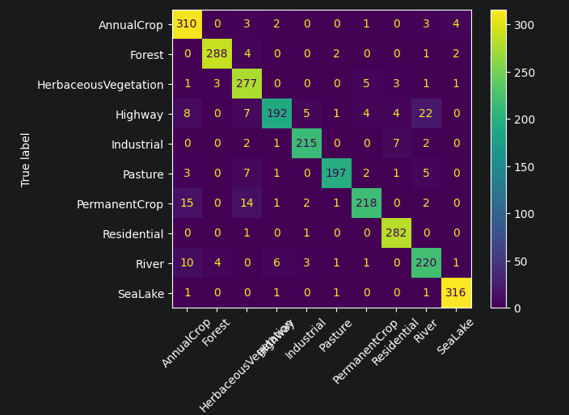

# Satellite land-use classification with deep learning (EuroSAT)
A deep-learning classifier that labels satellite tiles by land-use type.

## Problem
Classify Sentinel-2 satellite tiles into 10 land-use types. This kind of automated land-use mapping supports urban planning and land-use monitoring.

## Dataset
EuroSAT: 27k images, 10 classes

## Approach
Transfer learning: pretrained ResNet18 (ImageNet), froze the backbone, replaced the final layer with a 10-class head.
PyTorch on Colab GPU. 80/10/10 train/val/test split. Trained with CrossEntropyLoss + Adam.

## Results
- **Test accuracy: 92.6% vs a ~10% random baseline (10 balanced classes)**
  
  ```                       
                          precision    recall  f1-score   support
    
                  AnnualCrop   0.89      0.96      0.92       323
                      Forest   0.98      0.97      0.97       297
        HerbaceousVegetation   0.88      0.95      0.91       291
                     Highway   0.94      0.79      0.86       243
                  Industrial   0.95      0.95      0.95       227
                     Pasture   0.97      0.91      0.94       216
               PermanentCrop   0.94      0.86      0.90       253
                 Residential   0.95      0.99      0.97       284
                       River   0.86      0.89      0.87       246
                     SeaLake   0.98      0.99      0.98       320

                    accuracy                       0.93      2700
                   macro avg   0.93      0.93      0.93      2700
                weighted avg   0.93      0.93      0.93      2700
  ```
  

Thanks to transfer learning, the model reached ~90% after a single epoch — the pretrained features did most of the work; further epochs added marginal gains.

**Where it fails (and why):** the crop/vegetation confusion,
the Highway↔River mix-up, and both confusions involve classes that look nearly identical from above, so it's a limitation of the imagery, not a model failure.

## How to Run
Open the notebook in Colab → set Runtime to GPU → Run all.

## Possible improvements
- Unfreeze and fine-tune the backbone
- More epochs / learning-rate scheduling
- Data augmentation